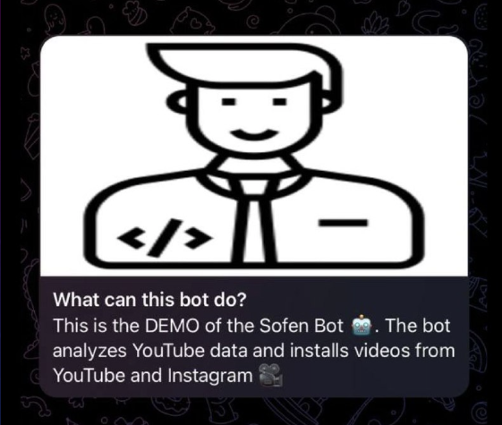
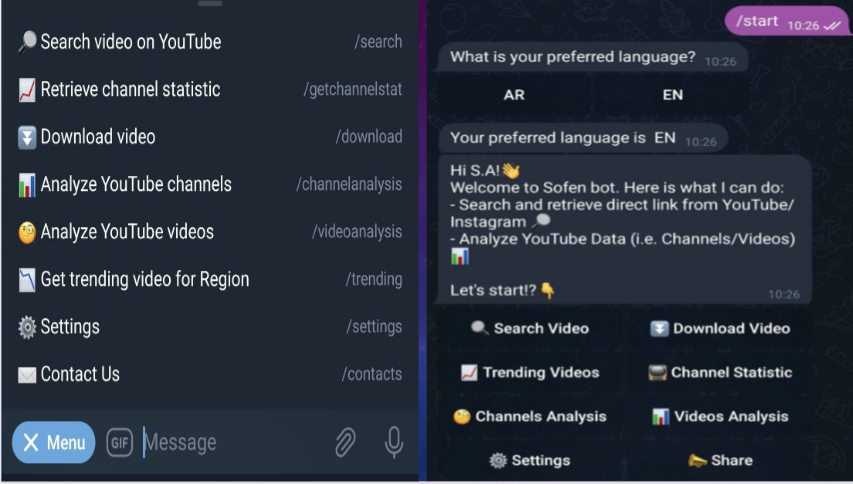
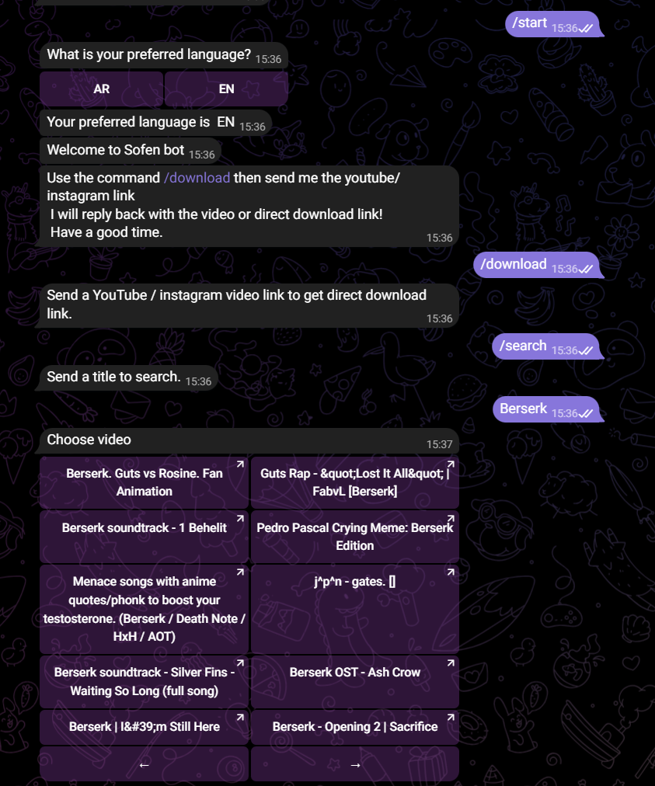
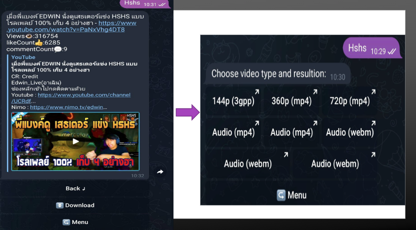
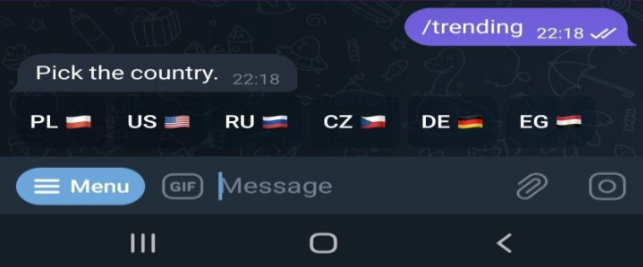
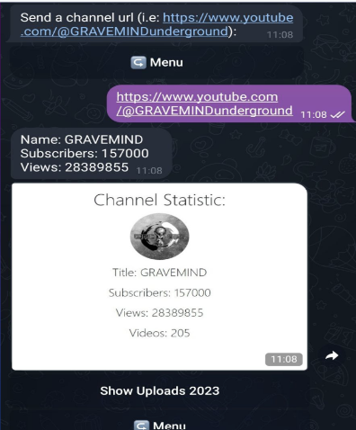
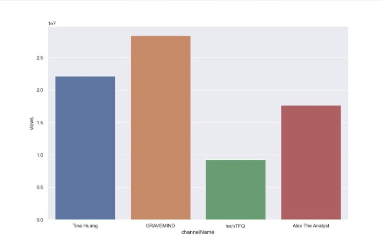
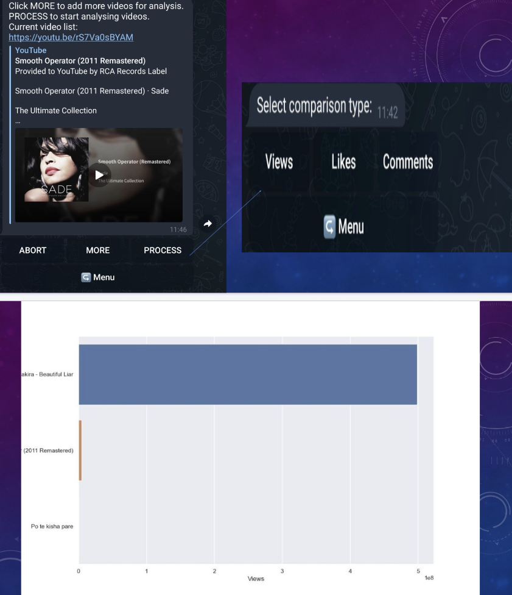

# SofenBot: Telegram Bot for YouTube/Instagram Downloading



## Overview

Sofenbot is a Python-based Telegram bot designed as a project for university Subject "Software Engineering". The bot allows users to download videos from YouTube and Instagram by simply sending the URL to the bot.

## Features

- Download YouTube videos
- Download Instagram videos
- Simple and easy-to-use commands
- Error handling and user feedback

## Libs

Install the required packages

```bash
pip install -r requirements.txt
```

## Environment

Create a '.env' file with your Tokens:

```makefile
TELEGRAM_API_TOKEN=your_telegram_api_token
GOOGLE_API_TOKEN=your_google_api_token
```

## Usage

Run the bot using the following command:

```bash
python sofenbot.py
```

## Features

### Menu



### Search



### Search Result



### Trends



### YouTube Channel Statistics



### Channels Analysis and Comparison



### Video Analysis and Comparison



## TODO

1. Current State of Project requires Libraries Updates
2. Some Code Places require fixes
3. Update of the requirements files
4. Overall Code Improvement+Refactor

## Contribute

Please feel free to contribute and help with project fixes/improvements
